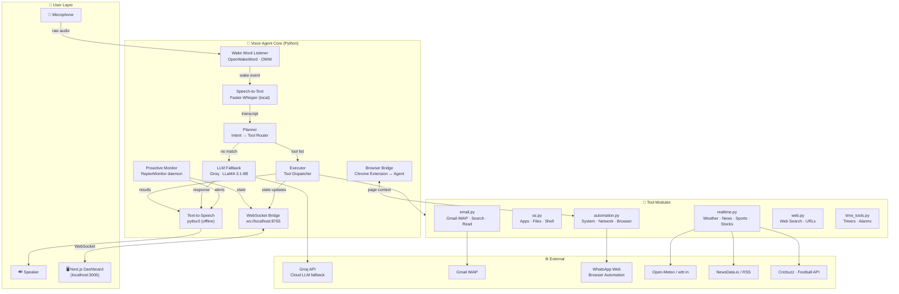
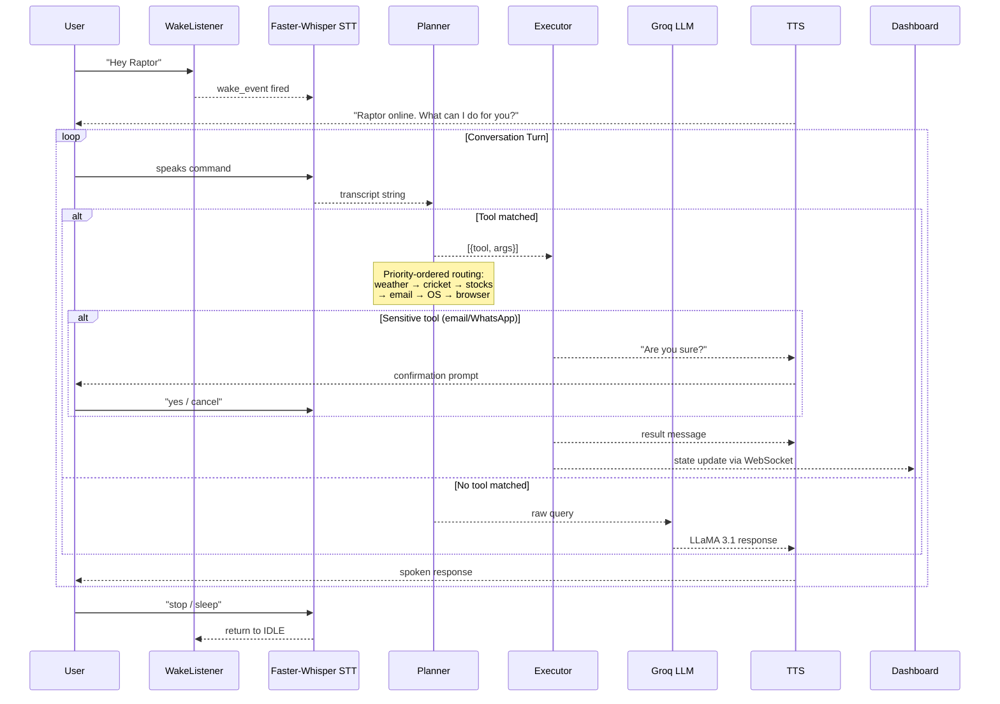
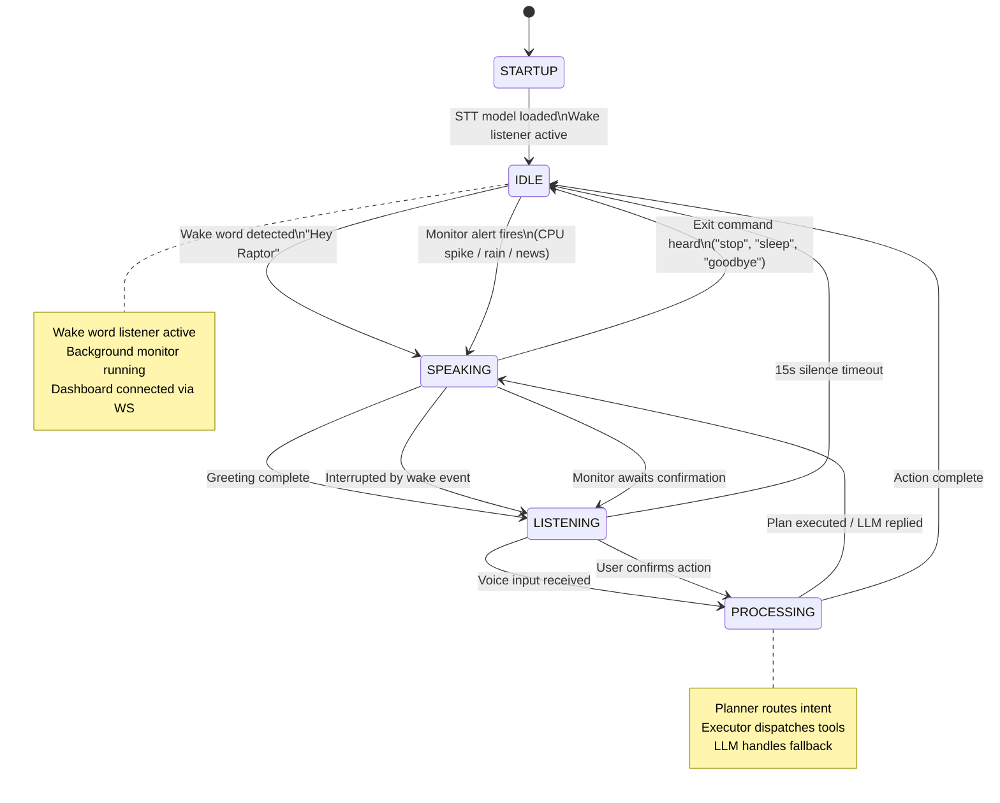
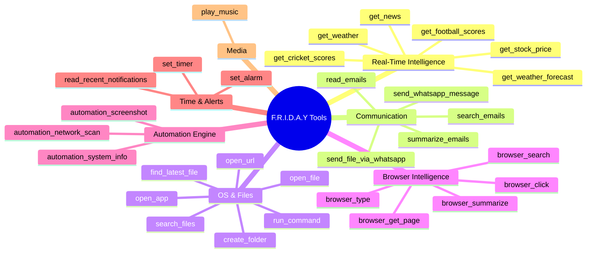
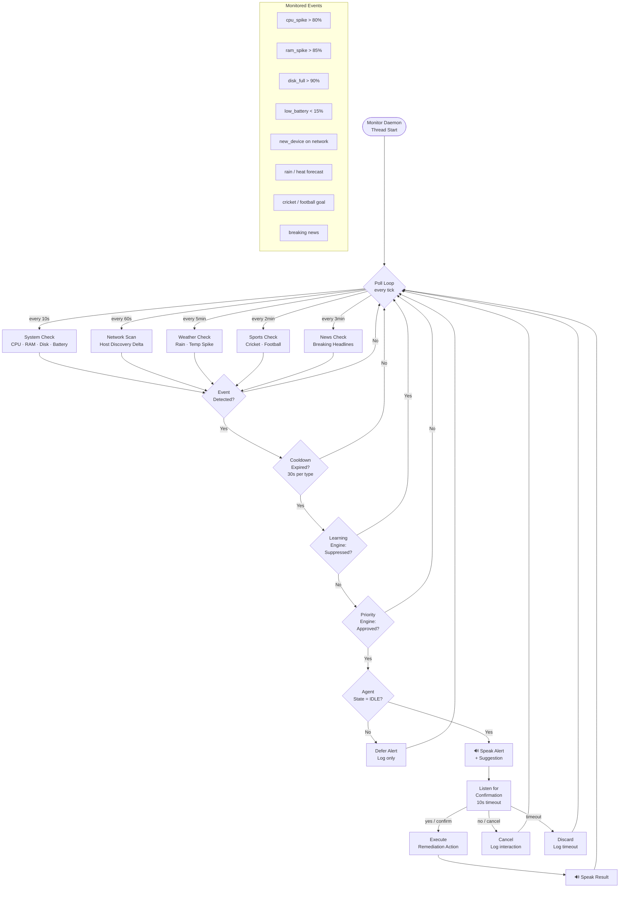

<div align="center">

# 🦅 Stealth F.R.I.D.A.Y

### **Fully Responsive Intelligent Digital Autonomous Yielder**

> A locally-running, offline-first AI voice agent with real-time system monitoring,  
> browser intelligence, multi-tool execution, and a Next.js dashboard — all on your machine.

[](https://python.org)
[](https://nextjs.org)
[](https://groq.com)
[](https://microsoft.com/windows)
[](LICENSE)

</div>

---

## 📖 Table of Contents

- [Overview](#-overview)
- [System Architecture](#-system-architecture)
- [Core Pipeline Flow](#-core-pipeline-flow)
- [Agent State Machine](#-agent-state-machine)
- [Tool Ecosystem](#-tool-ecosystem)
- [Proactive Monitor](#-proactive-monitor)
- [Project Structure](#-project-structure)
- [Installation](#-installation)
- [Configuration](#-configuration)
- [Launching](#-launching)
- [Capabilities](#-capabilities)
- [Tech Stack](#-tech-stack)

---

## 🧠 Overview

**Stealth F.R.I.D.A.Y** is a fully local, privacy-first AI voice assistant. Unlike cloud-dependent assistants, it runs entirely on your hardware — no persistent data leaves your machine.

It listens for a custom wake word (`"Hey Raptor"`), transcribes speech using **Faster-Whisper**, routes intent through a rule-based planner + LLM fallback (via **Groq / LLaMA 3.1**), executes tools, and responds with natural TTS — all in real-time.

A **Next.js dashboard** streams live agent state, last command, active module, and system health via **WebSocket**.

---

## 🏗 System Architecture



---

## 🔄 Core Pipeline Flow



---

## 🔁 Agent State Machine



---

## 🔧 Tool Ecosystem



---

## 🛡️ Proactive Monitor

The `RaptorMonitor` daemon runs as a background thread with no interaction required — it watches your system and world events and proactively alerts you.



---

## 📁 Project Structure

```
Stealth F.R.I.D.A.Y/
│
├── 🚀 launch_raptor.bat          # Start backend agent (Windows)
├── 🚀 launch_frontend.bat        # Start Next.js dashboard (Windows)
│
├── voice_agent_core/             # 🧠 Core Python agent
│   ├── agent.py                  # Main LocalVoiceAgent class & run loop
│   ├── server.py                 # FastAPI REST server
│   ├── raptor_launcher.py        # Process management launcher
│   │
│   └── core/
│       ├── wake_listener.py      # OpenWakeWord integration
│       ├── local_audio.py        # STT (Faster-Whisper) + TTS (pyttsx3)
│       ├── planner.py            # Intent → tool routing (480+ rules)
│       ├── executor.py           # Tool dispatch + result handling
│       ├── intelligence.py       # Automation engine + context memory
│       ├── monitor.py            # Proactive background daemon
│       ├── health_check.py       # Startup system validation
│       ├── ws_bridge.py          # WebSocket server (port 8765)
│       ├── browser_bridge.py     # Chrome extension ↔ agent bridge
│       ├── learning_engine.py    # Interaction history & suppression
│       ├── priority_engine.py    # Alert priority scoring
│       │
│       ├── tools/
│       │   ├── realtime.py       # Weather, news, sports, stocks
│       │   ├── email.py          # Gmail IMAP tools
│       │   ├── automation.py     # System/network/browser automation
│       │   ├── os.py             # App launching, file ops, shell
│       │   ├── browser.py        # Browser control tools
│       │   ├── web.py            # Web search
│       │   └── time_tools.py     # Timers & alarms
│       │
│       └── external_monitors/
│           ├── weather_monitor.py
│           ├── news_monitor.py
│           └── sports_monitor.py
│
├── frontend/                     # 🖥️ Next.js Dashboard (TypeScript)
│   └── src/
│       ├── app/
│       │   ├── page.tsx          # Main dashboard page
│       │   └── api/
│       │       ├── raptor/       # Agent control endpoints
│       │       └── token/        # Auth token route
│       │
│       ├── components/
│       │   ├── RaptorVisualizer.tsx   # Animated state visualizer
│       │   ├── StateIndicator.tsx     # IDLE/LISTENING/PROCESSING badges
│       │   ├── ActiveAgent.tsx        # Live agent info panel
│       │   ├── CommandPanel.tsx       # Command history & wake button
│       │   └── ModuleDisplay.tsx      # Active tool module display
│       │
│       └── hooks/
│           └── useRaptorSocket.ts     # WebSocket ↔ React state hook
│
├── extension/                    # 🌐 Chrome Extension
│   ├── manifest.json
│   ├── background.js             # Service worker
│   └── content.js                # Page context injector
│
├── external_modules/
│   └── automation_script/        # Network scanning & system tools
│
└── raptor-ai/                    # 🗂️ Canonical source / reference build
```

---

## ⚙️ Installation

### Prerequisites

| Requirement | Version |
|------------|---------|
| Python | 3.11+ |
| Node.js | 18+ |
| Git | Any |
| Windows | 10/11 |

### 1. Clone the repository

```bash
git clone https://github.com/ronitsaha11/Stealth-FRIDAY.git
cd Stealth-FRIDAY
```

### 2. Set up the Python environment

```bash
cd voice_agent_core

# Create virtual environment
python -m venv .venv
.venv\Scripts\activate

# Install dependencies
pip install -r requirements.txt
# or if using pyproject.toml:
pip install -e .
```

### 3. Install frontend dependencies

```bash
cd ../frontend
npm install
```

### 4. Install Chrome Extension *(optional — for browser intelligence)*

1. Open Chrome → `chrome://extensions`
2. Enable **Developer mode**
3. Click **Load unpacked** → select the `extension/` folder

---

## 🔑 Configuration

Copy the example env file and fill in your API keys:

```bash
cp voice_agent_core/.env.example voice_agent_core/.env
```

```env
# Required for LLM fallback
GROQ_API_KEY=gsk_...

# Required for email tools
GOOGLE_API_KEY=AIza...
GOOGLE_APPLICATION_CREDENTIALS=path/to/credentials.json

# Required for real-time data
OPENAI_API_KEY=sk-...        # optional, alternative LLM

# Optional external services
SARVAM_API_KEY=sk_...        # Indian language TTS
DEEPGRAM_API_KEY=...         # Alternative STT
SUPABASE_URL=https://...     # Ticketing system
SUPABASE_API_KEY=...
```

> **Note:** The agent runs fully offline for voice, OS tools, timers, and browser control. API keys are only needed for email, Groq LLM fallback, and live data (weather/sports/news).

---

## 🚀 Launching

### Windows (Recommended)

Run both scripts — each opens its own terminal window:

```bat
launch_raptor.bat       # Starts the Python voice agent
launch_frontend.bat     # Starts the Next.js dashboard on :3000
```

### Manual

```bash
# Terminal 1 – Backend
cd voice_agent_core
.venv\Scripts\activate
python agent.py

# Terminal 2 – Frontend
cd frontend
npm run dev
```

The dashboard will be available at **http://localhost:3000**  
The WebSocket bridge runs at **ws://localhost:8765**

---

## 💬 Capabilities

| Category | Example Commands |
|---------|-----------------|
| **Wake** | *"Hey Raptor"* |
| **Weather** | *"Weather in Mumbai"*, *"Forecast for Delhi this week"* |
| **Sports** | *"What's the IPL score?"*, *"Live football scores"* |
| **News** | *"What's happening in the world?"*, *"Latest headlines"* |
| **Stocks** | *"Bitcoin price"*, *"What's Tesla stock at?"* |
| **Email** | *"Read my emails"*, *"Summarize emails"*, *"Search emails from John"* |
| **WhatsApp** | *"Send hello to Mum on WhatsApp"*, *"Send my resume to Priya"* |
| **Apps** | *"Open Chrome"*, *"Launch VS Code"*, *"Open Task Manager"* |
| **Files** | *"Find my latest PDF"*, *"Create a folder named Projects"* |
| **Browser** | *"What is this page?"*, *"Summarize this page"*, *"Click Sign In"* |
| **Timer** | *"Set a timer for 10 minutes"*, *"Wake me at 7am"* |
| **Music** | *"Play some music"*, *"Play Blinding Lights"* |
| **Sleep** | *"Stop"*, *"Sleep"*, *"Goodbye"* |

---

## 🧰 Tech Stack

| Layer | Technology |
|-------|-----------|
| **Wake Word** | OpenWakeWord (OWW) |
| **Speech-to-Text** | Faster-Whisper (local, offline) |
| **Text-to-Speech** | pyttsx3 (offline) |
| **LLM** | Groq · LLaMA 3.1-8B-Instant |
| **Email** | Gmail IMAP (imaplib) |
| **System Monitoring** | psutil (cross-platform) |
| **WebSocket** | websockets (Python) |
| **Frontend** | Next.js 15 · TypeScript · TailwindCSS |
| **Browser Extension** | Chrome MV3 |
| **Real-time Data** | Open-Meteo · wttr.in · NewsData.io |
| **Platform** | Windows 10/11 |

---

## 🔐 Privacy

- All STT/TTS runs **100% locally** — your voice never leaves your machine
- Wake word detection is **on-device** via OpenWakeWord
- API calls are made only for: Groq LLM fallback, Gmail (IMAP), and live data feeds
- `.env` files are excluded from version control via `.gitignore`

---

## 🤝 Contributing

Pull requests are welcome. For major changes, please open an issue first to discuss what you would like to change.

---

## 📄 License

MIT © [Ronit Saha](https://github.com/ronitsaha11)

---

<div align="center">
  <sub>Built with ❤️ by Ronit Saha · Stealth F.R.I.D.A.Y runs on your machine, for your machine.</sub>
</div>
